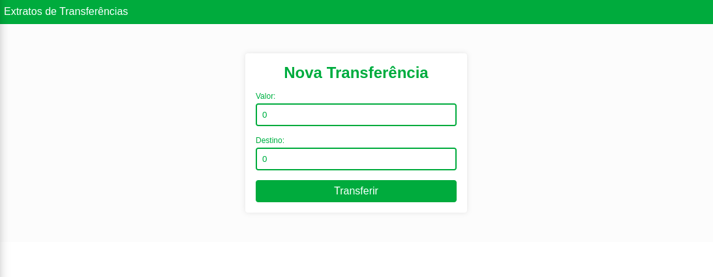
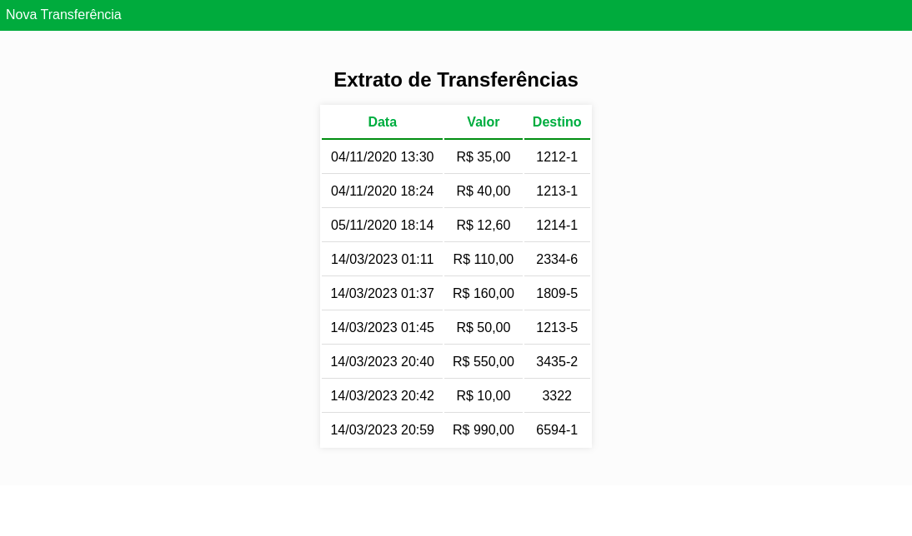

<h1 align="center"> Byte Bank</h1>

Projeto desenvolvido durante a primeira etapa da formação angular do Alura.  

  <a href="#-tecnologias">Tecnologias</a>&nbsp;&nbsp;&nbsp;|&nbsp;&nbsp;&nbsp;
  <a href="#-projeto">Projeto</a>&nbsp;&nbsp;&nbsp;|&nbsp;&nbsp;&nbsp;
  <!-- <a href="#-layout">Layout</a>&nbsp;&nbsp;&nbsp;|&nbsp;&nbsp;&nbsp; -->
  <a href="#memo-licença">Licença</a>

  

 

Tela de Transferências: 
 
  

Tela de Extrato: 
 
  

## 🚀 Tecnologias

Esse projeto foi desenvolvido com as seguintes tecnologias:

- [Angular CLI](https://github.com/angular/angular-cli) version 15.0.4.
- Typescript
- Json Server
- Angular Routes
- Git e Github

## 💻 Projeto

Para rodar o projeto:

Através de algum terminal execute o seguinte comando:  
`git clone https://github.com/HenriqueMVSS/byteBank-angular`

Após concluir o clone do repositório:  

Roda `npm install` para instalar as dependências do projeto.

## :memo: Licença

Esse projeto está sob a licença MIT.

---
